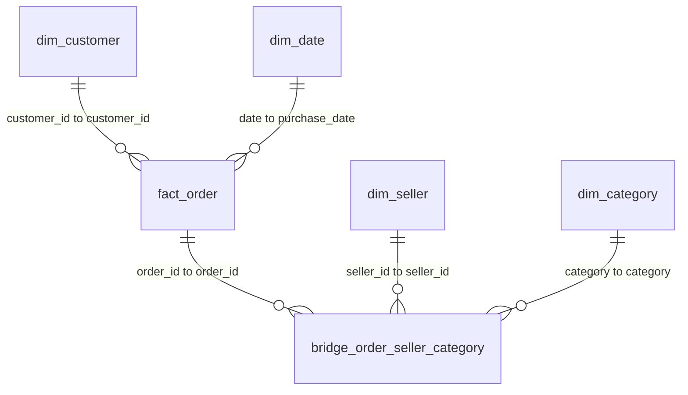

# Relationship map

```mermaid
erDiagram
 dim_customer ||--o{ fact_order : "customer_id to customer_id"
 dim_date ||--o{ fact_order : "date to purchase_date"
 fact_order ||--o{ bridge_order_seller_category : "order_id to order_id"
 dim_seller ||--o{ bridge_order_seller_category : "seller_id to seller_id"
 dim_category ||--o{ bridge_order_seller_category : "category to category"
```

Use 06_PowerBI/relationships.csv for implementation. Logical keys are checked in the loader and duplicate_keys SQL controls. ISO date-only keys relate to dim_date[date].
