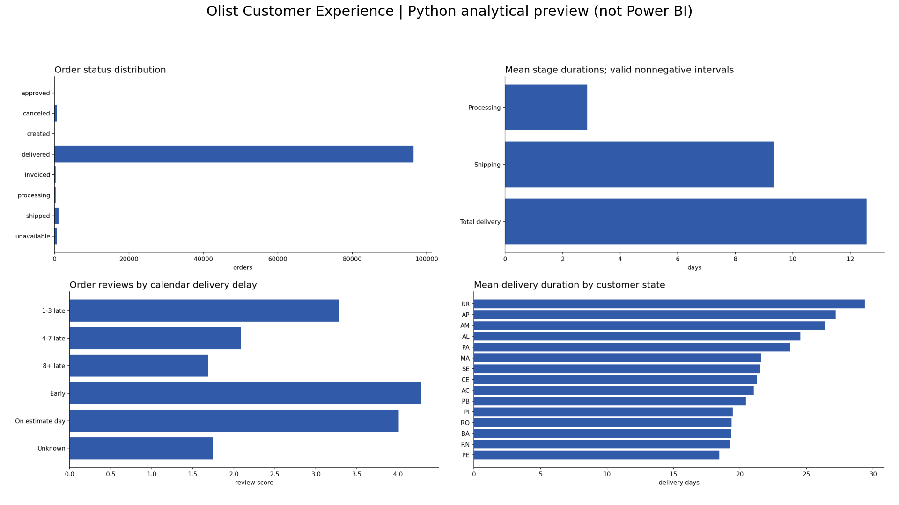

# Olist Customer Experience

**Owner:** Satya Ranjan Nayak

**Status:** Source analysis completed; Power BI Desktop build remains manual.

## Business Problem

Which delivery stages, routes and seller groups are associated with poor reviews and unreliable delivery?



## Dataset

https://www.kaggle.com/datasets/olistbr/brazilian-ecommerce

Source snapshot (download raw CSVs into `01_Raw_Data/` before rerunning): https://github.com/dujiaying/olist/tree/96d0db2e45e684d5a7069911368d823a19e82d38/data . Git blob hashes verified byte-for-byte. Preserve these files unchanged; the pipeline writes derived CSVs elsewhere. See source_manifest.json for local SHA256 hashes. Review original dataset license before redistribution.

## Tools Used

Python (pandas, NumPy, SciPy, Matplotlib), SQLite SQL, Excel, and a Power BI reproduction package. No ML model. No .pbix is claimed.

## Dataset Architecture

See [relationship map](08_Documentation/data_model.md), [data dictionary](08_Documentation/data_dictionary.csv) and [metric definitions](08_Documentation/metric_definitions.md).

## Data Cleaning

Exact duplicate records removed in derived data; conflicting entity keys fail validation. String values trimmed; dates parsed explicitly; invalid elapsed durations excluded from relevant KPI averages. Unknown values stay NULL. Raw files stay unchanged. See data_quality_summary.csv and source_manifest.json after a successful run.

## Business Questions

The four dashboard pages map each visual to a business question in dashboard_documentation.md. SQL answers channel/segment or operational performance questions with explicit denominator choices.

## SQL Analysis

Four scripts cover quality controls, date coverage, grouped business outcomes, and advanced CTE/window analyses. Query results are saved separately in 03_SQL/results. SQLite is the supported dialect; no server setup required. Schema is generated from observed data types, with logical keys validated by Python and SQL controls.

## Python Analysis

Executed cleaning and analysis notebooks accompany this Olist Customer Experience project. Descriptive statistics, segmentation, correlation or exploratory group tests are used where meaningful.

## Excel Analysis

The workbook imports manageable complete SQL result tables and adds formula-based comparison metrics. Detailed row-level records remain in cleaned CSVs. Native slicers and PivotTables are not claimed. See 05_Excel/README.md for workbook scope and refresh procedure.

## Dashboard

Four-page Power BI specification, DAX library, typed CSV model, relationship map, theme and Power Query loader are supplied. Python preview images and an offline HTML report visualize calculated outputs but are not Power BI screenshots.

## Key Insights

- 99,441 orders; 96,478 delivered; 625 cancelled (0.63%).
- 96,470 orders had valid delivery and estimated dates; 6.77% were late by calendar date.
- Mean review was 4.28 for on-time orders versus 2.26 for late orders; association does not establish causation.
- Mean processing time was 2.85 days and mean shipping time was 9.33 days; available-timestamp samples differ.
- 170 sellers met the priority rule: at least 50 eligible orders and a late rate above the portfolio rate.
- 99,441 orders had a selected review; overall mean score was 4.07.

## Recommendations

- Audit high-volume sellers with above-baseline late rates first; verify carrier handoff records and inventory availability before attributing responsibility.
- Compare processing and shipping separately on the same complete-timestamp sample before assigning an operational intervention.
- Test revised delivery estimates on routes with persistent positive delays; track both promise accuracy and total transit time.
- Use matched-route comparisons or controlled operational experiments to evaluate improvements in reviews.

## Limitations

- Calendar dates define on-time delivery because estimated dates are day-level promises. Same-day delivery counts as on-time.
- Latest review response, then creation time and review ID, determines one selected review per order. Raw review history remains unchanged.
- Processing and shipping averages exclude negative timestamp intervals independently; their samples may differ.
- Multi-seller and multi-category orders count once at order grain. Seller/category comparisons use distinct order membership and cannot uniquely assign blame.
- No carrier identifier exists. Shipping bottlenecks are measured by routes and elapsed time, not named-carrier performance.
- Review associations do not prove operational causation; confounding by category, geography, season and seller mix remains.

## Repository Structure

```
01_Raw_Data/  source acquisition instructions (raw CSVs excluded from Git)
02_Cleaned_Data/  dimensional and fact CSVs
03_SQL/  schema, analysis scripts and query outputs (database regenerated locally)
04_Python/  standalone pipeline and two notebooks
05_Excel/  workbook and its data export
06_PowerBI/  DAX, M, theme, relationships and visual specifications
07_Images/  real Python chart previews
08_Documentation/  definitions, quality report, validations and recommendations
```

## Restore the Included Order Table

The full cleaned order CSV is stored as two lossless compressed parts to fit upload limits. After cloning or downloading the repository, restore it before opening the Power BI model or importing that table:

```bash
python 04_Python/restore_data.py
```

The script verifies the restored CSV against its original SHA256 hash. Other cleaned tables are ready to use.

## How to Reproduce the Analysis

```bash
python -m pip install -r requirements.txt
python 04_Python/pipeline.py
```

Run notebooks from 04_Python or project root after source acquisition. All raw source files must be present. Pipeline exports cleaned data, runs every named SQL query and validates control totals. Regenerate the Excel workbook using the included artifact-tool builder in the ChatGPT runtime, or import the exported result CSVs into Excel using Data > From Text/CSV. Power BI Desktop instructions are in 06_PowerBI/dashboard_documentation.md.
